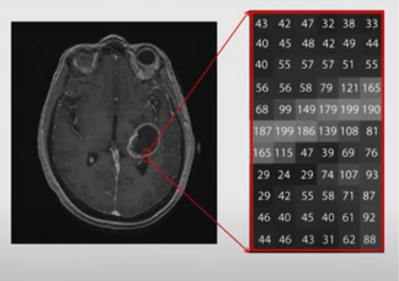
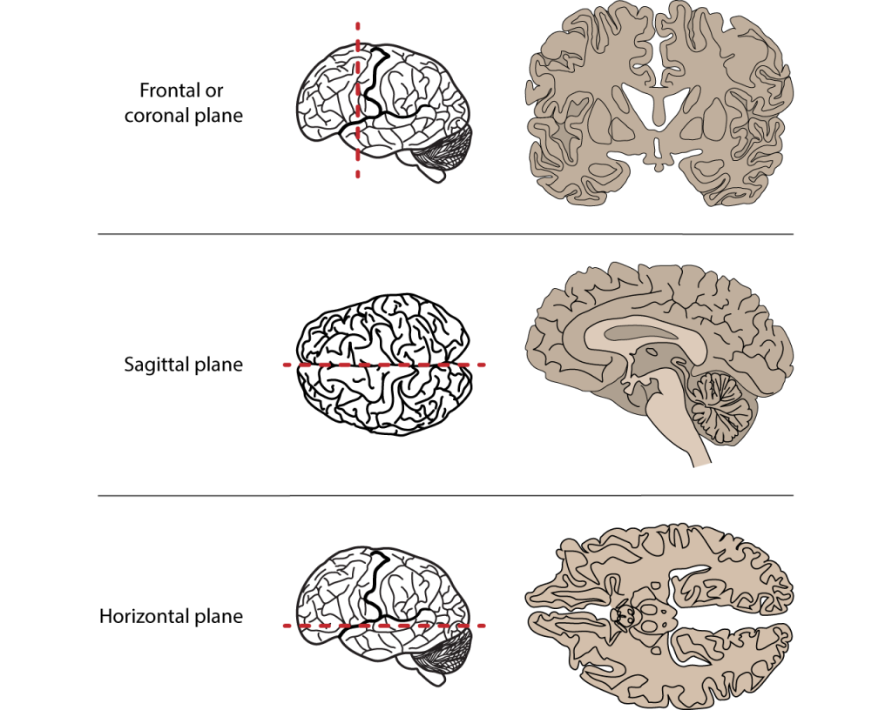

# Introduction

This document gives a basic tutorial on how to work with structural MRI data stored in NIfTI files. The first half gives a recap of the theory behind MRI machines and what kind of data we are actually working with. The second half is about visualizing neuroimaging data and manipulating it to draw correlation between disease severity and pathological manifestation (more specifically lesion size), by using the dataset including people with post-stroke aphasia. Hope you find it interesting and this tutorial inspires you to explore the topic more! ☺️

## Before we begin: A little recap on MRI

To start working with neuroimaging, it's important to understand the basics of MRI and what the images we see actually represent. Magnetic Resonance Imaging (MRI) —is a technique used to visualize the internal structures of the body, and in our case, the brain. What we’re trying to do is quantify the properties of different tissues, such as gray matter, white matter, cerebrospinal fluid (CSF), or lesions. To achieve this, we use weighted MRI images. These images don’t have absolute or objective brightness values; instead, their intensities are relative and depend on how the MRI sequence is set up. By using several types of weighted images, we can extract meaningful information (for example the T1 value of tissues).

MRI works because water is magnetic, and our bodies are about 60% water. Each water molecule has two hydrogen atoms, and these tiny hydrogen nuclei act like miniature magnets. Under normal conditions, these hydrogen atoms are randomly aligned. But when a person is placed inside the powerful magnetic field of an MRI scanner, many of the hydrogen protons align with that field, creating a more ordered system. This alignment mainly affects the low-energy hydrogen atoms, which is what the machine focuses on.

The MRI scanner then uses a technique called resonance to gather information. It sends out radiofrequency (RF) pulses, which briefly disturb the alignment of the hydrogen atoms. When the RF pulse is turned off, the atoms gradually return to their original alignment. As they do, they release a tiny amount of electromagnetic energy, which is picked up by RF coils placed around the body. These signals differ based on the type of tissue, the amount of water or fat it contains, and how the molecules behave. Stronger signals are associated with tissues that have more hydrogen protons, like in areas of edema or inflammation, while the timing of the signal tells us about the environment and state of the tissue.

Two important measurements in MRI are T1 and T2 relaxation times. These describe how quickly hydrogen protons realign with the magnetic field (T1) or how quickly they lose their phase coherence (T2). Different tissues—and especially lesions—have distinct T1 and T2 values, making them appear differently on scans.

**T1-weighted imaging** measures how fast protons realign with the magnetic field. It provides a clear map of brain anatomy and is excellent for structural imaging. When a contrast agent is used, active or inflamed lesions can become more visible. On T1 images, fat and suba-cute blood typically appear bright, while fluids like CSF, edema, and lesions appear dark. You can think of T1 like viewing the brain under regular lighting—it shows you structure and clarity.

**T2-weighted imaging**, in contrast, measures how quickly protons lose synchronization with each other. T2 is more sensitive to water content and is particularly good for spotting fluid, inflammation, or other pathological changes. In T2 images, things like CSF, edema, cysts, and lesions appear bright, while fat, calcifications, and bone tend to appear dark. You might imagine T2 as looking at the brain under blacklight—suddenly all the ‘wet’ or abnormal areas light up.

Sometimes, T2 images are modified using a sequence called **FLAIR** (Fluid-Attenuated Inversion Recovery). CSF appears very bright on T2, which can make it hard to see subtle lesions near the ventricles or cortex. FLAIR solves this by suppressing the CSF signal, allowing small lesions to stand out while maintaining the T2 sensitivity of surrounding tissues. This makes FLAIR ideal for spotting MS plaques, small metastases, or cortical strokes. On FLAIR images, edema, demyelination, tumors, and strokes appear bright, while normal CSF appears dark—like turning off the glow from water to focus on hidden areas.

See Figure 1. for a visual representation on how T1, T2 and FLAIR images appear from an MRI scan. 

There are of course also other types of sequences, like DWI or fMRI, but in this tutorial we will be mainly focusing on structural MRI and more specifically the T1 and T2 weighted images. 


*Note*: the picture was taken from: Rodriguez-Hernandez A, Babici D, Campbell M, Carranza-Reneteria O, Hammond T. Hypoglycemic hemineglect a stroke mimic. eNeurologicalSci. 2023 Jan 17;30:100444.

Now that we have the basics, let’s try to understand what kind of data is actually portrayed on these MRI scans and what we can do with them.

An MRI picture is like a 3D map of our brain, which is built from approx. 7 million of tiny building blocks, called voxels. A voxel is a 3D pixel. It’s a little cube of brain tissue, and the MRI machine measures how water behaves in it and assigns it a number. That number becomes the shade of gray in the picture. **Dark areas** have **low numbers** (less signal), while **bright areas** have **high numbers** (more signal). 

However, whether something appears bright or dark depends on the contrast type (so if it’s T1 or T2 for example). What changes between T1 and T2 is what kind of tissue gives off a strong or weak signal. *For example*: in T1 the CSF appears dark, meaning it has a lower signal, and a lower number assigned. On the other hand, in the T2 the CSF appears bright, meaning it has a higher signal, and a higher number assigned. See Figure 2. of a single, axial slice of the brain, showing how to imagine the portrayal of the “data” on these MRI pictures. Although, here a single slice is presented for better understanding, keep in mind that we usually look at the whole of the brain, which is made up of many-many different slices. 



*Note*: this picture was taken from the video: Elizabeth Sweeney -  Neuroimaging Analysis in R [Internet]. 2019 [cited 2025 Apr 18]. Available from: <https://www.youtube.com/watch?v=9HkEq01nrco>

In this tutorial we will be working with **NIfTI files** (in 'nii.' or 'nii.gz' formats), which is the standard file format for storing MRI brain imaging data (both the image data and metadata, like voxel size, orientation etc.). It is a **3D array** (X, Y, Z), where:

-   X is the width (left to right in the brain)

-   Y is the depth (front/back (anterior/posterior))

-   and Z is the height (up/down (superior/inferior).

Let’s say that we want to take a slice of the brain at the 125th index “deep” in the brain, including its whole width and height (creating a coronal view). Figure 3. shows how we can do this, and how you should imagine this in the 3D plane. 

![**Figure 3. Visual representation about the different axes of the 3D arrays of NIfTI files.** The axes are denoted in black. When we call these different slices we use a format like this: data [X, Y, Z]. If we want to include the whole width and height, we can just leave a comma at the place of X and Z. So, the red section represents the 125th slice along the Y axis (which is the axis of anterior-to-posterior), including its whole width and whole height (so represented as: [, 125 ,])](images/3D_Brain_Axes.png)

For future reference, the different axes of the brain are also visualized in the figure below. It’s good to have this on hand when working with neuroimaging.



## Description of the ARC dataset

For this tutorial we will be using the [Aphasia Recovery Cohort (ARC) Dataset](https://openneuro.org/datasets/ds004884/versions/1.0.1), which is a collection of data from multiple studies conducted over several years. This is a large, open-access neuroimaging dataset, that contains longitudinal data from 230 individuals with post-stroke aphasia. The dataset includes multimodal MRI data (T1, T2, FLAIR, fMRI, DWI),  detailed behavioral assessments (via the Western Aphasia Battery (WAB)) and demographic information. The dataset contains scanning sessions across different time points, ranging from days to years post-stroke. 

Enrollment requirements included individuals who had experienced a left-hemisphere stroke at least 6 months (or 12 months for some studies) prior to enrollment, between the ages of 21 and 80 years old, with no contraindications to MRI or additional neurological impairments (such as multiple sclerosis, Parkinson’s, dementia, etc). It is important to note that many individuals participated in multiple studies. 

If you would like to learn more about a specific aspect of the study, see the [link](https://www-nature-com.utrechtuniversity.idm.oclc.org/articles/s41597-024-03819-7) taking you to the publication. 

However, the scans that are included in the ARC dataset are raw MRI scans. This means that the dataset includes the original, unprocessed MRI scans, directly as they were acquired from the scanner. These images have not been normalized to a standard template (so the scans are still in the position the subject’s head was positioned in the scanner, with all their unique brain size and shape), still contain non-brain tissues (e.g. the skull) and are usually in the scanner’s native space and orientation amongst other things. 

Luckily, the researchers of the study provided post-processed images for educational purposes that can be accessed through this [link](https://github.com/neurolabusc/AphasiaRecoveryCohortDemo). These images include spatially normalized scans, lesion masks mapped to each participant’s anatomy (showing where the brain damage is in one individual’s scan), lesion incidence maps across the cohort (a group-level visualization that shows how frequently a particular brain regions is damaged across participants) and scripts that link lesion location to behavioral performance (like the WAB).

We will be using these post-processed images for our next steps.

## Description of the libraries and packages.

We will be using these packages:

-   `oro.nifti` - This package is the core R package for working with NifTI files. It writes and loads NifTI files into R as 3D or 4D arrays. It’s basic functions include: `readNIfTI()` and `writeNifTI()`

-   `neurobase` - This package is a part of the [Neuroconductor](https://neuroconductor.org/) project, which hosts a collection of R packages specifically for neuroimaging analysis, building on R’s existing ecosystem. It builds on oro.nift, and adds helpful functions for image math, masks, plotting, etc. 

The earlier mentioned Neuroconductor system can also come in handy later for your future projects. If you type this in R you will be able to download and run an R script hosted on the Neuroconductor website:

```{r}
source("https://neuroconductor.org/neurocLite.R")
```

That script defines the `neuro_install()` function, which can be used to install any Neuroconductor package like this:

```{r}
neuro_install("neurobase")
```

So, let’s get started!

As stated earlier, we will be using the post-processed images. For now let’s use the NifTi file that is called “wbsub-M2001_ses-1253x1076_T1w.nii.gz” and you will find it under 'files' within the project's folder.

Here is what each part of this file name means:

-   'sub-M2001' corresponds to the subject ID

-   'ses-1253x1076' means that they likely combined scans from session 1253 and session 1076. The numbers refer to how many days after the stroke the given imaging session took place, so in this case it was 1076 and 1253 days post-stroke

-   'T1w' means the scan type.

# Getting Started

## Loading our packages and files

First you will have to install the packages and only then will you be able to load them in from the library:

```{r}
install.packages("oro.nifti")
library(oro.nifti) # handling NifTI images
install.packages("neurobase")
library(neurobase) # has additional neuroimaging analysis tools
install.packages("dplyr") 
library(dplyr) #creating a table with our data
install.packages("ggplot2")
library(ggplot2) # we will need later for visualization

```

Next we will load in our NIfTI file from patient M2001. Since we are using one file for now, it is easier if you download it into your local folder, where your R file is also saved (! this is important). To load our file we will use the read NIfTI command from the `oro.nifti` package.

```{r}
t1_img_M2001 <- readNIfTI("files/wbsub-M2001_ses-1253x1076_T1w.nii", reorient = TRUE)

```

The `reorient = TRUE` ensures that the image is aligned properly in a standard orientation, which is useful for consistency.

## Checking image properties

Before we can do anything with pretty pictures, we have to inspect the properties of our NIfTI file. It’s good to know the physical size of the voxels, for accurate measurements of brain structures as well as understanding the orientation, so that the anatomical structures are correctly identified and the analyses are consistent across datasets.

First, we can check the number of voxels along each axis. This helps us understand the resolution and size of the 3D image. Run this chunk of code and see the output:

```{r}
dim(t1_img_M2001) 
```

However, maybe it is smarter to have a comprehensive summary of the NIfTI object, including data type (each voxel’s intensity is stored as a 16-bit signed integer), dimensions, (number of voxels in X,Y and Z planes), pixel dimension (indicates how much each voxel measures) and voxel units.This provides a quick overview of the image’s metadata and structure.

```{r}
t1_img_M2001
```

Next, we can also list all the metadata slots available in the NIfTI object, which allows us to see what additional information is stored and is accessible within the object. We can do this by typing this:

```{r}
slotNames(t1_img_M2001)
```

From all of this the most important thing is that we know the dimension of the images: 157 × 189 × 156. This means that it comprises 157 voxels in the x-axis, 189 in the y-axis, and 156 in the z-axis.

## Visualizing our brain images

Now let’s look at our image. We can do this two ways. If we want a quick visualization of our image, the `orthographic()` function from the oro.nift package displays NIfTI objects in an orthogonal view, across 3 different planes (axial, sagittal and coronal). This way of looking at our data is more neuroimaging-specific and offers a convenient way to inspect 3D images. The picture is also very cool, and could even be published! You will see the image under “Plots” in R. Run this code to see the visual output we get:

```{r}
orthographic(t1_img_M2001)
```

The other option is to use the `image()` function from the `oro.nifti` package. This shows a mosaic view with all slices in a given orientation from a brain MRI. It might take a few minutes to run the code below. Can you recognize which view these are oriented in?

```{r}
image(t1_img_M2001)
```

Here we can see that it portrays consecutive slices row-wise from inferior to superior. We can see that the brain has been well pre-processed. The brain structures are symmetrical and clean, and there is no visible skull tissue, indicating successful brain extraction. There is also a good contrast between the white and gray matter. Keep in mind that this simplifies the portrayal of the brain into axial slices, but in reality we have a 3D array of voxels from the MRI scan.

If we would like to extract a specific slice from the array we have to specify its position along the 3 axes. We can do this by using the `image()` function from the `oro.nifti` package.

This line of code displays the sagittal slice at index 125 (so we have to specify which slice we want to get along the X axis, representing the left-to-right dimension). See the description in the beginning with the 3D picture of the brain and the annotations (Figure 3). This can be especially useful for examining structures along the mid-line of the brain or assessing lateralized features.

```{r}
image(t1_img_M2001[125,,]) 
# the commas represent that we include all indexes along X and Y axes

```

The X and Y axis on this picture that is produced actually translates as:

-   X axis (on output) is actually the Y plane of the brain (so left-to-right)

-   Y axis (on output) is actually the Z plane of the brain (so front-to-back)

## Lesion volume calculation

Let’s say we would like to calculate the volume of the lesion this patient has. 

To do this, we would need a lesion mask. A lesion mask is a binary image used in neuroimaging to identify and isolate regions of brain tissue that have been damaged due to conditions such as stroke. In this mask, each voxel (a 3D pixel) is assigned a value:​

-   **1** indicates the presence of a lesion

-   **0** indicates healthy or unaffected tissue

This allows for the calculation of lesion volume by summing the number of voxels labeled as lesions (so 1) and multiplying by the volume of each voxel.

Lesion masks can be created from the MRI images, however it has to be done manually with external tools, like FSLeyes. Unfortunately, R does not provide built-in tools for manual lesion delineation.

Although it is very interesting to learn how to use these tools, we will be working with a lesion mask that is already provided for subject M2001. This is also available on the GitHub page with the processed images (in the ‘NIfTI’ folder, if you search for your subject with Ctrl+F there will be two files corresponding, one is the MRI scan and one is the extracted brain lesion).

We read this lesion mask, similar to how we did the MRI scan (note to include your unique path to the file):

```{r}
lesion_mask <- readNIfTI("files/lesion_masks/wsub-M2001_ses-1253x1076_lesion.nii", reorient = TRUE)
```

Then we look at a summary of this NIfTI object. We can do this by simply running the variable we stored the lesion mask in. Keep an eye out on the ‘Pixel Dimension’ as we will need to use this later to calculate the lesion volume:

```{r}
lesion_mask
```

If you are curious what this looks like just run `image(lesion_mask)` or `orthographic(lesion_mask)`.

Okay now the calculating begins. First we will count the number of voxels labeled as 1 (remember that 1 indicates the presence of a lesion).

```{r}
orthographic(lesion_mask)

lesion_voxels <- sum(lesion_mask == 1)
```

Then, we retrieve voxel dimensions (in mm) via the `pixdim()` function. The array in the NIfTI header contains scaling information for each dimension of the image data (you can get this information by running `lesion_mask@pixdim`).

(The output if we run `lesion_mask\@pixdim` is : `-1 1 1 1 0 0 0 0`)

-   The first value indicates the orientation of the image axes. For this example it would be -1, which suggests left-handed coordinate system (while 1 would indicate a right-handed system).

-   The second, third and fourth value in this array indicates the voxel dimensions along the x, y, and z axes, respectively. In our case these are all 1.

-   The rest of the values are usually used for other dimensions like time. In our case they are 0, indicating that they are not used in our dataset.

So we are only interested in the second to fourth value from the ‘pixdim’ array, meaning we will have to filter these out with the use of the square-brackets.

```{r}
voxel_dims <- pixdim(lesion_mask)[2:4] 
```

Then we calculate the volume of a single voxel in mm³. We will be doing this via the `prod()` function, which is part of R’s base package.

```{r}
voxel_volume_mm3 <- prod(voxel_dims)
```

Now we calculate the product of the number of voxels (`lesion_voxels`) and the volume of a single voxel (`voxel_volume_mm3`) to get the total lesion volume . 

```{r}
lesion_volume_mm3 <- lesion_voxels * voxel_volume_mm3
```

Now we can have a nice output of our result by using the `cat()` base R function, which concatenates and outputs its arguments:

```{r}
cat("Lesion Volume:", lesion_volume_mm3, "mm³")
```

There is a table also linked to this dataset that contains participants’ information such as sex, age at stroke, race, the days after the stroke when participant took the WAB (Western Aphasia Battery) test, the Aphasia Quotient (AQ) from this test (which is a score out of 100, measuring language function in people with brain injury (like stroke) - see Table 1. on how to interpret the scores for the AQ part of the WAB) and the type of aphasia.

**Table 1. WAB-AQ scores**

|              |              |
|--------------|--------------|
| **AQ Score** | **Severity** |
| 0-25         | Very severe  |
| 26-50        | Severe       |
| 51-75        | Moderate     |
| 76+          | Mild         |

*Note*: The information for this table was taken from: [Western Aphasia Battery (WAB) – Strokengine](https://strokengine.ca/en/assessments/western-aphasia-battery-wab/#Compositescores:)

We can load the table containing all this information by doing this. Hit `View(df)` to see the data frame:

```{r}
df <- read.delim("files/participants.tsv", sep ="\t", header =TRUE)
View(df)

```

Let’s put to use what we learnt. Let’s say we want to see how lesion size and WAB-AQ scores correlate. We can do this by following these steps:

Let’s pick subjects M2001, M2004, M2060 and M2069 who all have the same type of aphasia (anemic, which is a type of aphasia where patients find it hard to find words, but have near-normal speech). 

Let’s make a function to calculate the lesion volume using what we did for M2001. We can do this by: 

```{r}
calculate_lesion_volume <- function(mask_path) {
  lesion_mask <- readNIfTI(mask_path, reorient = TRUE)
  lesion_voxels <- sum(lesion_mask == 1)
  voxel_dims <- pixdim(lesion_mask)[2:4]
  voxel_volume_mm3 <- prod(voxel_dims)
  lesion_volume <- lesion_voxels * voxel_volume_mm3
  return(lesion_volume)
}
```

How this works is the following:

-   the function is called: `calculate_lesion_volume`

-   this function will take a variable that is the path to the lesion mask: `function(mask_path)`

-   the following are just copied from what we did earlier:

```         
lesion_mask <- readNIfTI(mask_path, reorient = TRUE)
lesion_voxels <- sum(lesion_mask == 1)
voxel_dims <- pixdim(lesion_mask)[2:4]
voxel_volume_mm3 <- prod(voxel_dims)
lesion_volume <- lesion_voxels * voxel_volume_mm3
```

-   to output the final volume we use: `return(lesion_volume)`

Now we will use these functions to compute lesion volume per subject. We call function for each subject’s lesion mask files (M2001, M2004, M2060, and M2069). This will return a number (volume in mm³ for each participant), which will be stored in named variables (lesion_volume_2001, lesion_volume_2004 etc. - see on the right under ‘Values’):

```{r}
lesion_volume_M2001 <- calculate_lesion_volume("files/lesion_masks/wsub-M2001_ses-1253x1076_lesion.nii")
lesion_volume_M2004 <- calculate_lesion_volume("files/lesion_masks/wsub-M2006_ses-2381x1773_lesion.nii")
lesion_volume_M2060 <- calculate_lesion_volume("files/lesion_masks/wsub-M2060_ses-220_lesion.nii")
lesion_volume_M2069 <-calculate_lesion_volume("files/lesion_masks/wsub-M2069_ses-5818_lesion.nii")

```

Now we will use the table with the participant information.

For this we will need to use the `dplyr` library, so make sure to copy paste this in the beginning of your code (you might have to download the package):

```{r}
library(dplyr)
```

We add the lesion volume variable to this table, but first we create a data frame where we store the participant id with the matching lesion volume. We create the new table like this:

```{r}
lesion_volumes <- data.frame(
  participant_id =c("sub-M2001", "sub-M2004", "sub-M2060", "sub-M2069"),
  lesion_volume_mm3 = c(lesion_volume_M2001, lesion_volume_M2004, lesion_volume_M2060, lesion_volume_M2069)
)

```

Now we can merge this table with the bigger participants table (`df`) to do analysis. We do so by using the `inner_join()` function, which merges rows from the df and `lesion_volumes` table only where `participant_id` matches in both:

```{r}
merged_data <- inner_join(df, lesion_volumes, by = "participant_id")
```

Finally, we can do our analysis. Let’s do a correlation analysis to see whether higher WAB-AQ scores correlate positively to higher lesion volumes. The `cor.test()` function performs a Pearson’s correlation test, using the lesion volume and WAB-AQ scores as arguments. This outputs the correlation coefficient, p-value and other statistics.

```{r}
cor.test(merged_data$lesion_volume_mm3, as.numeric(merged_data$wab_aq))
```

So the correlation is a negative value (-0.5635701), indicating a trend where larger lesion volume indicates lower WAB-AQ scores. The p-value is \> 0.05 (it is 0.4364), meaning that this is not statistically significant. However, we have a very small sample size (4 participants) so that can explain why our results are so insignificant.

However, it would be nice to visualize this correlation. Let’s create a scatter plot, using ggplot, with the lesion volume on the X-axis, and the WAB-AQ score on the Y-axis.

To add a regression line we use geom_smooth, where we set method = “lm” to specify the linear model, and additionally set se=FALSE, to hide the shaded confidence interval around the line (optional).

```{r}
ggplot(merged_data, aes(x = lesion_volume_mm3, y = wab_aq, label = participant_id)) + 
  geom_point(size = 3, color="black") +  
  geom_smooth(method = "lm", se = FALSE, color = "black", size=0.6) +  
  geom_text(vjust = -0.5, size = 3) +  # participant labels
  labs(
    title = "Lesion Volume vs WAB-AQ",
    x = "Lesion Volume (mm³)",
    y = "WAB-AQ Score"
  ) +
  theme_minimal()

```

We can see a trend that could be negative correlation between higher WAB-AQ scores and larger lesion volumes. Is this a result you expected? You can also explore different aphasia types and see whether this correlation is also present in those.

Hope you enjoyed this tutorial and you feel more inspired to explore its potential more in R.

Some other useful resources if you are interested in [neuroimaging](https://neuroconductor.org/courses):

-   The Neuroconductor webpage has three online-courses: Courses \| Neuroconductor I highly recommend the one called “Imaging in R”.

-   There are two videos from Elizabeth Sweeney that give a very nice insight into what is possible with Neuroimaging in R. I recommend checking it out if you are interested:

    -   [Elizabeth Sweeney - Neuroimaging Analysis in R](https://www.youtube.com/watch?v=9HkEq01nrco&t=182s) (16:45 minutes)

    -   [Neuroimaging Analysis in R: Image Preprocessing](https://www.youtube.com/watch?v=6tDbdNTwEuA&t=2288s) (51:12 minutes)
